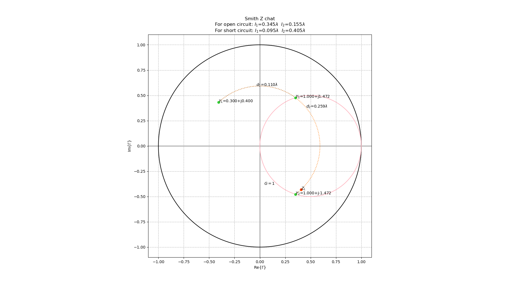
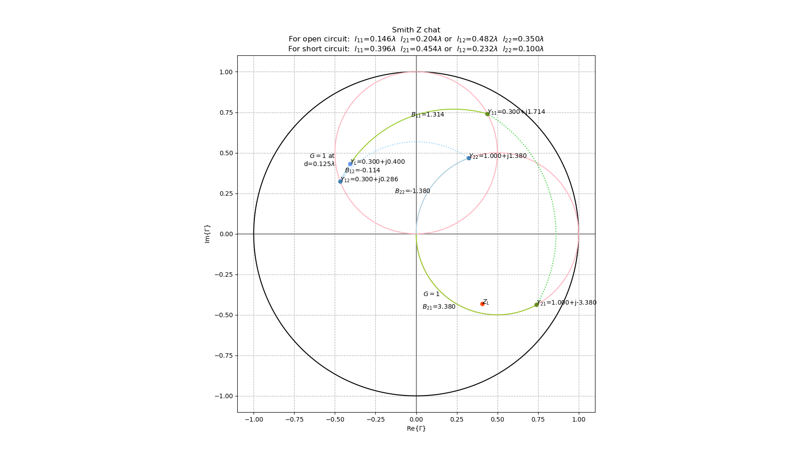

# Calculators for RF and Microwave Systems Engineering
It's 2020, who need to do single/double stub turning by compass?

## Single-Stub Turning
Example from textbook: David M.Pozar *Microwave Engineering 4th edition*
At Chap.5.2:

## Double-Stub Turning
At Chap.5.3:

## Multisection Impedance Matching
to be continue...